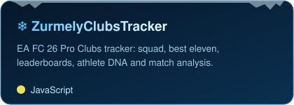
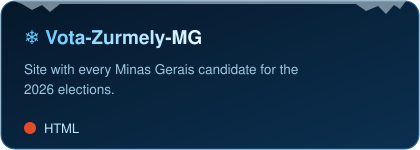
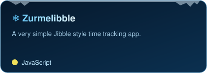
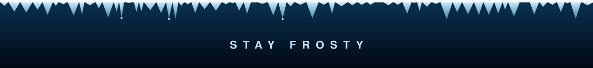

<!-- ❄ frozen profile ❄ -->

  

  

  
  

 

<h3 align="center">🧊 /whoami</h3>

  <i>Builds things that stay cold under load.</i> 
  trackers · dashboards · data sites · the occasional desktop app

 

<h3 align="center">❄️ toolkit</h3>

  
  
  
  
  
  

 

<h3 align="center">🏔️ frozen in the vault</h3>

  
  

  

 

<h3 align="center">🌨️ cold streak</h3>

  

 

  <picture>
    <source media="(prefers-color-scheme: dark)" srcset="https://raw.githubusercontent.com/hzurmely/hzurmely/output/snake-ice.svg"/>
    <source media="(prefers-color-scheme: light)" srcset="https://raw.githubusercontent.com/hzurmely/hzurmely/output/snake-ice-light.svg"/>
    
  </picture>

  

❄

 you found the part that didn't freeze.

